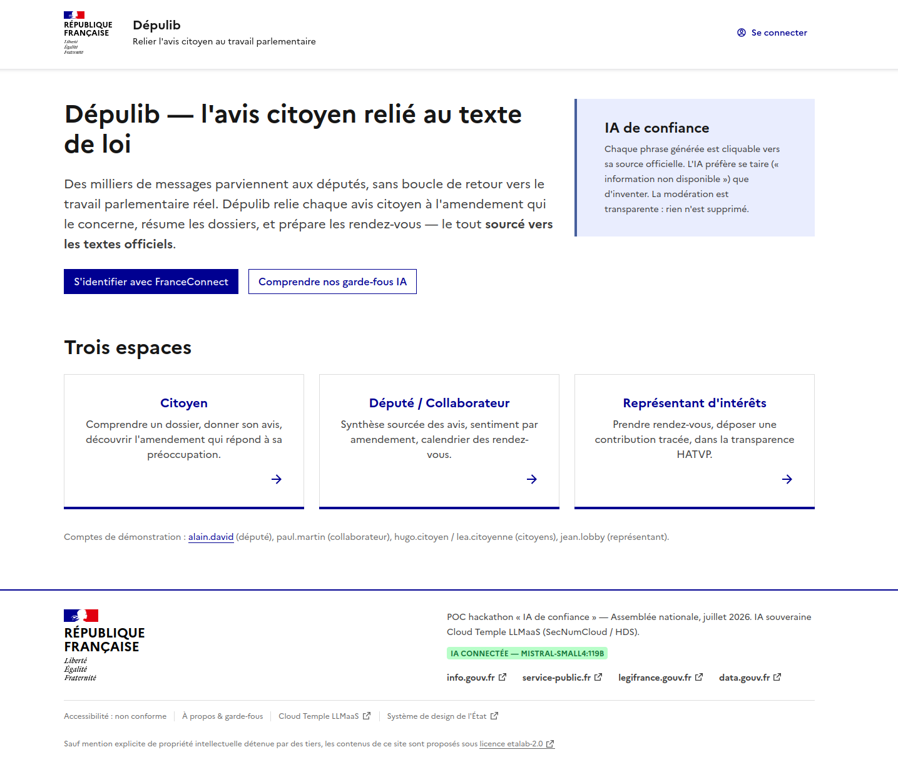

# DEFI.md

### Nom du défi
Dépulib - Le doctolib du député

### Description courte
Une plateforme qui relie l'avis des citoyens au travail parlementaire réel : chaque contribution est reliée à l'amendement en cours d'examen qui y répond, résumée pour les députés, et organise les rendez-vous avec les citoyens et les représentants d'intérêts — le tout sourcé vers les textes officiels.

### Porteur
Alexandre Girold

### Description longue
Dépulib rapproche trois publics qui peinent aujourd'hui à se parler : les **citoyens**, les **députés** et leurs collaborateurs, et les **représentants d'intérêts**.

- **Côté citoyen** : on donne son avis sur un dossier législatif. Une IA relie cet avis à l'amendement précis qui y répond, avec un résumé et un lien vers le texte officiel. Le citoyen peut alors soutenir cet amendement.
- **Côté député** : un tableau de bord synthétise les retours (jauge de sentiment, top des amendements, synthèse avec verbatims réels), et un calendrier organise les rendez-vous. Les documents déposés par les représentants d'intérêts y sont résumés automatiquement.
- **Côté représentant d'intérêts** : dépôt de contributions structurées et de documents (plusieurs fichiers acceptés), avec fiche HATVP rattachée pour la transparence.

**Une IA de confiance par conception** : toute sortie affiche ses sources cliquables vers les textes officiels ; les sources inventées par le modèle sont vérifiées et retirées côté serveur (anti-hallucination) ; l'IA ne relie un avis à un amendement que si elle est sûre, sinon elle se tait. L'inférence tourne sur une IA souveraine (Cloud Temple LLMaaS, SecNumCloud), avec un mode dégradé déterministe si l'IA est indisponible.

**Où intervient le serveur MCP** : les données législatives (dossiers, amendements, députés) sont récupérées via le **serveur MCP « tricoteuses »** de l'Assemblée nationale, qui donne un accès unifié aux données open data. C'est cette brique MCP qui alimente le catalogue de dossiers et d'amendements que l'application relie ensuite aux avis citoyens.

### Image principale

### Contributeurs
- Alexandre Girold
- Hugo Majerczyk
- Lucas Majerczyk

### Ressources utilisées
Cochez les ressources utilisées en remplaçant `[ ]` par `[x]`.

- [ ] `openfisca-france-parameters` — Base de données de paramètres ✺ OpenFisca
- [x] `an-dossiers-legislatifs` — Dossiers législatifs de l'Assemblée nationale (législature courante) ✺ Assemblée nationale
- [x] `an-amendements-xvii` — Amendements déposés à l'Assemblée nationale (législature actuelle) ✺ Assemblée nationale
- [ ] `an-comptes-rendus` — Comptes rendus de la séance publique à l'Assemblée nationale (législature actuelle) ✺ Assemblée nationale
- [ ] `an-votes-xvii` — Votes des députés (législature actuelle) ✺ Assemblée nationale
- [x] `an-deputes-en-exercice` — Députés en exercice ✺ Assemblée nationale
- [ ] `an-deputes-historique` — Historique des députés ✺ Assemblée nationale
- [x] `an-deputes-senateurs-ministres-par-legislature` — Députés, sénateurs et ministres d'une législature ✺ Assemblée nationale
- [ ] `an-agenda-reunions` — Agenda des réunions à l'Assemblée nationale (législature courante) ✺ Assemblée nationale
- [ ] `an-questions-gouvernement` — Questions de l'Assemblée nationale au Gouvernement ✺ Assemblée nationale
- [ ] `an-questions-gouvernement-ecrites` — Questions écrites de l'Assemblée nationale au Gouvernement ✺ Assemblée nationale
- [ ] `an-questions-gouvernement-orales` — Questions orales de l'Assemblée nationale au Gouvernement ✺ Assemblée nationale
- [ ] `premier-ministre-legi` — Codes, lois et règlements consolidés ✺ Premier ministre
- [ ] `premier-ministre-dole` — Dossiers législatifs Légifrance ✺ Premier ministre
- [ ] `premier-ministre-jorf` — Édition ''Lois et décrets'' du Journal officiel ✺ Premier ministre
- [ ] `senat-dispositifs-textes` — Dispositifs des textes déposés ou adoptés au Sénat ✺ Sénat
- [ ] `senat-dossiers-legislatifs` — Dossiers législatifs du Sénat ✺ Sénat
- [ ] `senat-amendements` — Amendements déposés au Sénat ✺ Sénat
- [ ] `senat-senateurs` — Sénateurs ✺ Sénat
- [ ] `senat-questions-gouvernement` — Questions orales et écrites du Sénat au Gouvernement ✺ Sénat
- [ ] `senat-comptes-rendus` — Comptes rendus de la séance publique au Sénat ✺ Sénat
- [ ] `an-et-co-database-regroupement-toutes-donnees` — Base de données unifiée Parlement / Législation / Service Public ✺ Assemblée nationale & communauté
- [x] `an-et-co-serveur-mcp-regroupement-toutes-donnees` — Serveur MCP  - Accès unifié Parlement / Législation / Service Public ✺ Assemblée nationale & communauté
- [ ] `an-et-co-api-regroupement-toutes-donnees` — API - Accès unifié Parlement / Législation / Service Public ✺ Assemblée nationale & communauté
- [ ] `legiwatch-api-parlement` — API Parlement ✺ LegiWatch
- [ ] `legiwatch-database-parlement` — Base de données Parlement ✺ LegiWatch
- [ ] `legiwatch-serveur-mcp-parlement` — Serveur MCP Parlement ✺ LegiWatch

### Galerie
- [Image 1](images/image-1.png)
- [Image 2](images/image-2.png)

### Documents
- [Tableur 1](hackathon-an-2026/docs/Classeur1.xlsx)
- [Document 2](hackathon-an-2026/docs/document-2.pdf)

### URL de démonstration
http://51.210.2.119:3000/

### Diapositives de présentation
[Diapositives de présentation](docs/diapositives.pdf)
